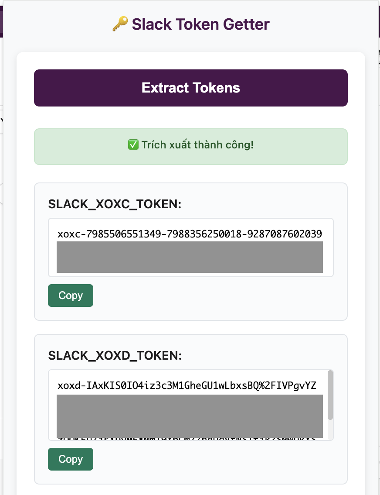

# Slack Token Getter

🔑 A secure Chrome extension to quickly extract Slack tokens for development purposes.

> 💡 **Perfect for [Slack Browser MCP Server](https://github.com/phuc-nt/slack-browser-mcp-server)** - Get your tokens instantly for AI assistant integration!

[](https://github.com/phuc-nt/slack-token-getter/releases)
[](LICENSE)
[](https://github.com/phuc-nt/slack-token-getter/releases)

## ✨ Features

- **One-click token extraction** - Extract both XOXC and XOXD tokens instantly
- **Ready for MCP integration** - Perfect for [Slack Browser MCP Server](https://github.com/phuc-nt/slack-browser-mcp-server)
- **JSON format output** - Copy tokens directly to your `.env` file
- **Security-first approach** - No data storage, local processing only



## 🚀 Installation

### Option 1: From GitHub Releases (Recommended)

1. **Download the extension**
   - Go to [Releases](https://github.com/phuc-nt/slack-token-getter/releases)
   - Download `slack-token-getter-v1.0.0.zip`

2. **Install in Chrome**
   - Open `chrome://extensions/`
   - Enable "Developer mode" 
   - Click "Load unpacked" → select extracted folder

### Option 2: From Source

```bash
git clone https://github.com/phuc-nt/slack-token-getter.git
cd slack-token-getter
```

Then follow step 2 above.

## 📖 Usage

1. Open your Slack workspace in Chrome browser
2. Click the extension icon in the toolbar
3. Click "Extract Tokens" button
4. Copy individual tokens or the complete configuration

### Using with Slack Browser MCP Server

Perfect for AI assistant integration! Use the extracted tokens with [Slack Browser MCP Server](https://github.com/phuc-nt/slack-browser-mcp-server):

```json
{
  "env": {
    "SLACK_XOXC_TOKEN": "xoxc-1234567890-...",
    "SLACK_XOXD_TOKEN": "xoxd-1234567890-...",
    "SLACK_TEAM_DOMAIN": "T1234567890"
  }
}
```

Then enable MCP-compatible AI assistants to interact with your Slack workspace directly!

## 🔧 Technical Details

- **Browser Support**: Chrome 88+, Edge 88+ (Chromium-based)
- **Permissions**: `activeTab`, `cookies`, `scripting`
- **Domains**: `*.slack.com` only
- **Architecture**: Manifest V3, CSP compliant

## 🛡️ Security & Privacy

- **Zero data collection** - No analytics, tracking, or data transmission
- **Local processing only** - All operations happen in your browser
- **No persistent storage** - Tokens are never saved
- **Domain restricted** - Only operates on Slack domains
- **Open source** - Full code transparency

## 🔗 Related Projects

- **[Slack Browser MCP Server](https://github.com/phuc-nt/slack-browser-mcp-server)** - Use these tokens to enable AI assistant integration with Slack

## 📄 License

This project is licensed under the MIT License - see the [LICENSE](LICENSE) file for details.

## ⚠️ Disclaimer

This extension is for legitimate development and automation purposes only. Users are responsible for complying with Slack's Terms of Service.